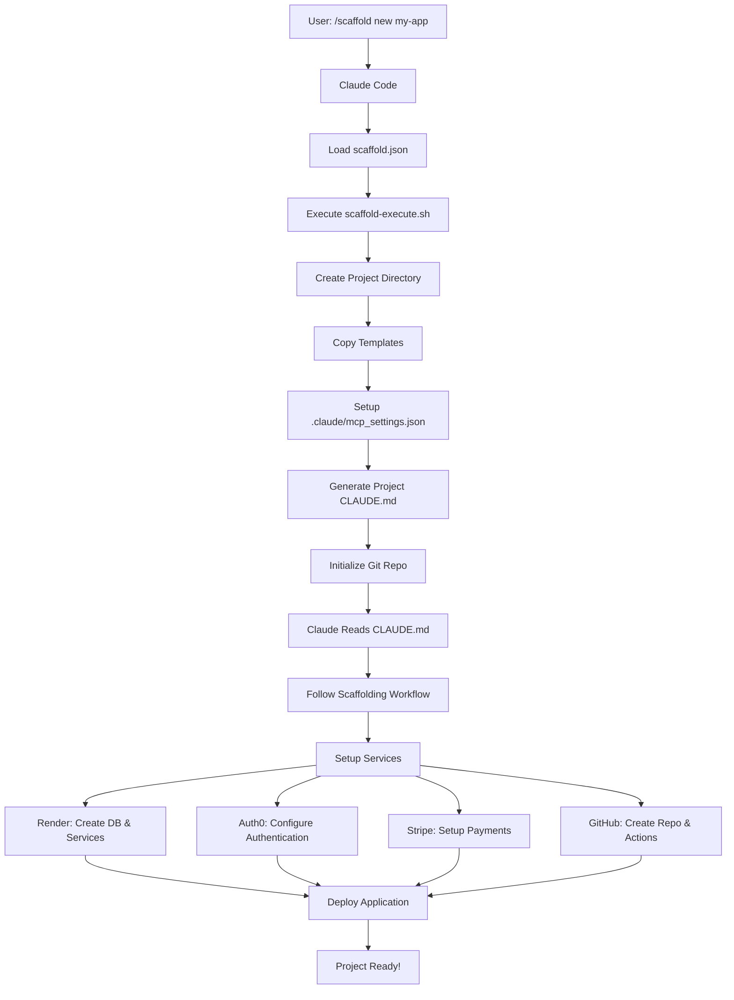

# Claude Code Project Scaffolding System

A comprehensive scaffolding system for Claude Code that automates the setup of modern full-stack applications with authentication, payments, and deployment infrastructure.

## ⚠️ Important: SPA Routing Configuration

For single-page applications with client-side routing and Auth0 authentication, you MUST configure URL rewrites:

### Option 1: render.yaml (Automated - Recommended)
```yaml
services:
  - type: static
    name: your-app-frontend
    routes:
      - type: rewrite
        source: /*
        destination: /index.html
```

### Option 2: _redirects file
Place in your public directory:
```
/*    /index.html   200
```

### Option 3: Manual Dashboard Configuration
If not using render.yaml, configure manually in Render Dashboard → Settings → Redirects/Rewrites

**Note:** The Render API/MCP server don't support programmatic rewrite configuration yet.

## 🏗️ Architecture & Flow

### Scaffold Command Flow



### Directory Structure After Scaffolding

```
my-app/
├── .claude/                      # Claude-specific configs
│   ├── mcp_settings.json        # MCP server configurations
│   └── project.json             # Project metadata
├── .scaffold/                   # Scaffolding reference
│   ├── CLAUDE.md               # Original scaffold instructions
│   ├── examples/               # Example configurations
│   ├── templates/              # Template files
│   └── scripts/                # Utility scripts
├── frontend/                    # Frontend application
│   ├── app/                    # Next.js app directory
│   ├── components/             # React components
│   ├── lib/                    # Utilities
│   └── public/                 # Static assets
├── backend/                     # Backend API
│   ├── src/                    # Source code
│   ├── config/                 # Configuration
│   └── package.json           # Dependencies
├── .github/                     # GitHub configuration
│   └── workflows/              # CI/CD pipelines
├── docs/                        # Documentation
│   └── ARCHITECTURE.md        # Architecture overview
├── CLAUDE.md                   # Project-specific Claude instructions
└── README.md                   # Project documentation
```

### How It Works

1. **Command Registration**: Run `scripts/register-scaffold-command.sh` to register the `/scaffold` command with Claude Code
2. **Command Invocation**: Use `/scaffold new my-app` or `/scaffold existing` in Claude Code
3. **Project Setup**: The scaffold script creates the project structure and copies all necessary files
4. **MCP Configuration**: Local `.claude/mcp_settings.json` is created with all required MCP servers
5. **Claude Instructions**: A project-specific `CLAUDE.md` is generated to guide Claude through the setup
6. **Service Initialization**: Claude follows the workflow to set up all services (Render, Auth0, Stripe, GitHub)
7. **Deployment**: Applications are deployed to staging and production environments

## 🚀 Features

- **Full-Stack Setup**: Frontend (Next.js/React) + Backend (Erlang/Node.js/Python)
- **Authentication**: Auth0 integration with role-based access control
- **Payments**: Stripe subscription management
- **Database**: Render PostgreSQL or Neon with automatic schema setup
- **Deployment**: Render services with staging and production environments
- **CI/CD**: GitHub Actions workflows for automated testing and deployment
- **Infrastructure as Code**: All services configured programmatically

## ⏱️ Time to Production

With Claude Code Scaffold, you can go from idea to deployed application in:
- **Initial Setup**: 5 minutes (one-time)
- **Project Creation**: 2 minutes
- **Service Configuration**: 15 minutes
- **Basic Features**: 30-60 minutes
- **Deployment**: 10 minutes

**Total: Under 2 hours for a production-ready application!**

## 📋 Prerequisites

### Required API Keys
- **Render API Key**: Get from [Render Dashboard](https://dashboard.render.com/account/api-keys)
- **GitHub Personal Access Token**: Create at [GitHub Settings](https://github.com/settings/tokens)
- **Stripe API Keys**: Get from [Stripe Dashboard](https://dashboard.stripe.com/apikeys)
- **Auth0 Credentials**: Get from [Auth0 Dashboard](https://manage.auth0.com)
- **Neon API Key** (optional): Get from [Neon Console](https://console.neon.tech/api-keys)

### CLI Tools (auto-installed if missing)
- `render` - Render CLI
- `gh` - GitHub CLI
- `stripe` - Stripe CLI
- `auth0` - Auth0 CLI

### MCP Servers (auto-configured)
- `render-mcp` - Render integration
- `github-mcp` - GitHub integration
- `stripe-mcp` - Stripe integration
- `playwright-mcp` - Browser automation (for Auth0)
- `neon-mcp` - Neon integration (optional)

## 📖 Complete Workflow Story

**[Read the full story: From Idea to Production](docs/WORKFLOW_STORY.md)** - Follow Sarah as she builds "PlantCare", a SaaS application, from concept to deployment in just 2 hours. Includes:
- Step-by-step walkthrough with real commands
- Best practices for prompting Claude
- Common workflows and pro tips
- Complete example from database design to production deployment

## 🎯 Quick Start

### Initial Setup (One-time)

```bash
# Clone the scaffolding system
git clone https://github.com/nisbus/claude-scaffold.git
cd claude-scaffold

# Register the /scaffold command with Claude Code
./scripts/register-scaffold-command.sh

# Restart Claude Code for changes to take effect
```

### New Project

In Claude Code, use the registered command:
```
/scaffold new my-awesome-app
```

Or ask Claude naturally:
```
"Please scaffold a new project called my-awesome-app"
```

### Existing Project

Navigate to your project directory, then in Claude Code:
```
/scaffold existing
```

Or ask Claude:
```
"Please scaffold this existing project with auth, payments, and deployment"
```

## 🔧 Configuration Options

### Backend Languages
- **Erlang** (default) - Cowboy framework, OTP, high concurrency
- **Node.js** - Express.js, familiar JavaScript
- **Python** - FastAPI, modern async Python

### Database Providers
- **Render PostgreSQL** (default) - Integrated, managed
  - Single database with schemas (cost-effective)
  - Separate databases (better isolation)
- **Neon** - Serverless, branching, auto-scaling

### Authentication Models
- **Basic** - Simple user/admin roles
- **SaaS Standard** - Free/Premium/Enterprise tiers
- **Marketplace** - Buyer/Seller roles
- **Organization** - Team-based permissions

### Pricing Models
- **Simple** - Free + Pro tiers
- **Tiered** - Multiple subscription levels
- **Usage-based** - Pay-as-you-go
- **Seat-based** - Per-user pricing

## 📁 Project Structure

### Generated Structure
```
my-app/
├── frontend/               # Next.js/React frontend
│   ├── app/               # App router pages
│   ├── components/        # React components
│   │   ├── auth/         # Auth0 components
│   │   └── stripe/       # Stripe components
│   └── lib/              # Utilities
├── backend/               # Backend service
│   ├── src/              # Source code
│   ├── config/           # Configuration
│   └── tests/            # Test files
├── .github/
│   └── workflows/        # CI/CD pipelines
│       ├── deploy-staging.yml
│       └── deploy-production.yml
├── .env.local            # Local environment variables
├── .scaffold-config.json # Scaffolding configuration
└── README.md            # Project documentation
```

## 🔄 Workflow

### 1. Initialization
```bash
./scripts/scaffold-init.sh new my-app
```
- Checks prerequisites
- Installs missing tools
- Configures MCP servers
- Authenticates services

### 2. Configuration
Interactive prompts for:
- Backend language selection
- Database provider choice
- Authentication model
- Pricing structure

### 3. Service Creation
Claude Code will:
- Create GitHub repository
- Setup Render services (frontend + backend)
- Configure Auth0 applications
- Create Stripe products and webhooks
- Initialize database schema

### 4. Code Generation
- Backend API scaffolding
- Frontend components
- Authentication flows
- Payment integration
- GitHub Actions workflows

### 5. Validation
Automatic verification of:
- Service health checks
- Authentication flow
- Payment processing
- Database connectivity

## 🤖 Claude Code Integration

### Manual Command
When prompted, Claude Code will execute:
```
claude-code scaffold new [project-name]
```

### Claude Code Instructions
The system provides Claude Code with:
- Step-by-step scaffolding workflow
- Service configuration templates
- Code generation patterns
- Validation procedures

### Interactive Flow
1. Claude Code reads `scaffold/CLAUDE.md` for instructions
2. Uses MCP servers to create services
3. Generates code based on templates
4. Configures environment variables
5. Sets up CI/CD pipelines

## 🔐 Security Best Practices

### Environment Variables
- Never commit secrets to repository
- Use Render environment variables for services
- Use GitHub Actions secrets for CI/CD
- Local `.env.local` added to `.gitignore`

### Authentication
- JWT validation on all API endpoints
- Role-based access control
- Secure session management
- Regular token rotation

### Database
- SSL/TLS connections required
- Connection pooling
- Row-level security
- Regular automated backups

## 🧪 Testing

### Local Development
```bash
# Install dependencies
npm install

# Run locally
npm run dev

# Run tests
npm test
```

### E2E Testing
```bash
# Install Playwright
npm run test:install

# Run E2E tests
npm run test:e2e

# Run specific test suites
npm run test:auth
npm run test:subscription
```

## 📊 Monitoring

### Service Health
- Render dashboard for service metrics
- Database performance monitoring
- API response time tracking

### Business Metrics
- Stripe subscription analytics
- User engagement tracking
- Feature usage statistics

## 🚨 Troubleshooting

### Common Issues

#### MCP Server Not Found
```bash
# Add to ~/.claude/mcp_settings.json
# Restart Claude Code
```

#### Auth0 Login Failed
```bash
# Use automated login
node scaffold/scripts/auth0-auto-login.js

# Or manual login
auth0 login
```

#### Database Connection Failed
```bash
# Check DATABASE_URL
# Verify SSL settings
# Check network connectivity
```

## 📚 Documentation

### Core Documents
- `scaffold/docs/ARCHITECTURE.md` - System architecture
- `scaffold/CLAUDE.md` - Claude Code instructions
- `scaffold/templates/` - Code templates

### Template Files
- `erlang/` - Erlang/OTP templates
- `node/` - Node.js/Express templates
- `python/` - Python/FastAPI templates
- `frontend/` - Next.js/React templates
- `github/` - GitHub Actions workflows

## 🔄 Maintenance

### Update Environment Variables
```bash
claude-code scaffold update-env
```

### Rotate Secrets
```bash
claude-code scaffold rotate-secrets
```

### Database Backup
```bash
claude-code scaffold backup-db
```

## 🤝 Contributing

1. Fork the repository
2. Create a feature branch
3. Make your changes
4. Add tests
5. Submit a pull request

## 📝 License

MIT License - See LICENSE file for details

## 🆘 Support

- **Documentation**: Read this README and docs/
- **Issues**: Report bugs on GitHub Issues
- **Questions**: Ask in discussions

## 🎉 Success Checklist

After scaffolding, verify:
- [ ] All services deployed and healthy
- [ ] Authentication working (test login)
- [ ] Payment flow working (test subscription)
- [ ] Database connected and seeded
- [ ] CI/CD pipelines running
- [ ] Environment variables set
- [ ] Documentation generated
- [ ] Local development working

## 🚀 Next Steps

1. **Customize** - Update branding, styling, and business logic
2. **Configure** - Set up custom domains and SSL
3. **Monitor** - Configure alerting and logging
4. **Scale** - Optimize performance and costs
5. **Secure** - Implement additional security measures

---

Built with ❤️ for rapid application development